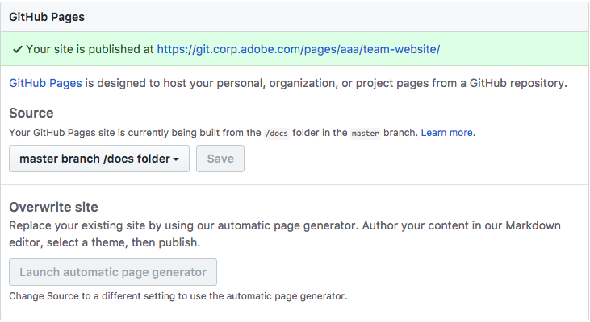

# <a name="setup" class="anchor">Setup</a>

## <a name="requirements" class="anchor">System Requirements</a>

These instructions are intended for users of Mac OS X. Other systems are not supported.

### <a name="xcode" class="anchor">XCode</a>
 
You will need to have XCode commandline tools installed. For more details, visit [Apple Developer XCode](https://developer.apple.com/xcode/features/).

### <a name="ruby" class="anchor">Ruby</a>

Mac OS X comes with Ruby installed however you may need a newer version of Ruby and upgrading the system's default Ruby is not recommended. First, make sure you have the latest version of XCode [Apple Developer XCode](https://developer.apple.com/xcode/features/). Then, you can try using [RVM](https://rvm.io/rvm/install) or another Ruby version manager to install a different version of Ruby on your machine while keeping the system version in place. 

To test your Ruby and git installations...

In terminal:
```
#Navigate to the directory
$ cd <project directory>

#Get the Ruby version
$ ruby -v

#Returns something like this
ruby 2.1.10p492 (2016-04-01 revision 54464) [x86_64-darwin16.0]

#Get the Ruby location (using RVM)
$ which ruby
/Users/walpole/.rvm/rubies/ruby-2.1.10/bin/ruby
```

If terminal can't find Ruby, make sure your XCode installation is up-to-date.
Make sure that it's also pointing to the correct Ruby location and that your bash_profile/profile docs don't have old references.

### <a name="git" class="anchor">git</a>

In terminal:
```
#Navigate to the directory
$ cd <project directory>

#Get the Git version
$ git --version

#Returns something like this
git version 2.13.5 (Apple Git-94)

#Get the Git location
$ which git
/usr/bin/git
```

If terminal can't find git, make sure your XCode installation is up-to-date.
Make sure that it's also pointing to the correct git location and that your bash_profile/profile docs don't have old references.


## <a name="adding_docs_remote" class="anchor">Adding Docs Remote to Existing Repository</a>

We are going to add a remote to our project. 

In terminal:

```
#Navigate to the directory
$ cd <project directory>

#Show our remotes
$ git remote show
origin
<other remotes if you have them>....

#Add a new remote
$ git remote add docs git@git.corp.adobe.com:aaa/docs.git

#Show the changes
$ git remote show docs
* remote docs
  Fetch URL: git@git.corp.adobe.com:aaa/docs.git
  Push  URL: git@git.corp.adobe.com:aaa/docs.git
  HEAD branch: master
  Remote branches:
    master        tracked
  Local ref configured for 'git push':
    master pushes to master (local out of date)
```

## <a name="adding_docs_subtree" class="anchor">Adding Docs Subtree</a>

Next, We are going to add the subtree to our project in a directory called docs.
This should pull in all the content on the first pass.

In terminal:

```
#Add the subtree (squash the history)
$ git subtree add --prefix=docs/ docs master --squash

#Checkout master branch(or another branch if you are going to do a pull request or merge it in)
$ git checkout master

#Add all of the new content in tracking
$ git add . 

#Commit the new content with message
$ git commit -m 'Adding the docs directory'

#Push to master branch (or the other branch if using another method)
$ git push origin master

```

## <a name="jekyll_config" class="anchor">Jekyll Configuration</a>

Next, we customize _config.yml file in the docs directory to make it all work. Use your preferred editor to make modifications. Change all references to "gh-pages-boilerplate" to your project and repository names where needed in the file.

```
#Checkout master branch
$ git checkout master

#User your favourite text editor here
cd <project directory>/docs/
$ vi ./docs/_config.yml (or use your preferred editor)

#Modify the file
title:  A@A Template Documentation
description: A demo of the template documents
email: 			adobeatadobe@adobe.com
baseurl: 	  "/pages/aaa/gh-pages-boilerplate" # the subpath of your site, e.g. /blog
theme: jekyll-theme-cayman # theme from jekyll github account
google_analytics: [Your Google Analytics tracking ID]
show_downloads: false
github: 
    is_project_page: true
    is_user_page: true
    repository_url: https://git.corp.adobe.com/aaa/**gh-pages-boilerplate**
    repository_name: 'GH Pages Boilerplate'
    owner_url: http://www.adobeatadobe.com
    owner_name: Adobe@Adobe
repository: aaa/gh-pages-boilerplate # location of your repository
markdown: kramdown # markdown engine

#Social Media Accounts
twitter_username: adobeatadobe
github_username: aaa
youtube_username: adobeatadobe
behance_username: adobeatadobe
wordpress_username: aaa

#Add and commit the changes
$ git add .
$ git commit -m 'Setting up the config file'

#Push the master branch
$ git push origin master
```

## <a name="install_docs" class="anchor">Installing Documentation (the Ruby Gems)</a>

At this point, you should be able to install successfully from the project directory and have the correct Ruby gems be installed.
These include github-pages (with Jekyll and SASS) and Kramdown gems (Markdown Engine). If there are errors, you will need to go back and check that you have Ruby installed correctly (check the version). Also, check that your Gemfile looks something like this:

```
source 'https://rubygems.org'
gem 'github-pages', group: :jekyll_plugins
gem 'kramdown'
```

In terminal:

```$ bundle install```

Upon success, try:

```$ bundle exec jekyll serve```

You will be given a url to visit showing you what your documentation will look like:

```
Configuration file: <project directory>/_config.yml
   GitHub Metadata: No GitHub API authentication could be found. Some fields may be missing or have incorrect data.
            Source: <source>
       Destination: <destination>
 Incremental build: disabled. Enable with --incremental
      Generating... 
                    done in 0.791 seconds.
 Auto-regeneration: enabled for '<project directory>'
    Server address: http://127.0.0.1:4000/<url>
  Server running... press ctrl-c to stop.
```

## <a name="github_config" class="anchor">GitHub Configuration</a>

Finally, we go to 'git.corp.adobe.com/aaa/respository_name' and then the 'Settings' tab. In there, you will find a section called 'Github Pages' which has a 'Source' field. Select 'master branch /docs folder' from the dropdown menu. If it's working correctly there will be a green bar in the top of this section that says "Your site is published at" with a url to your new documentation. Else, it will give you an error here. If the css looks broken this means you probably missed replacing something in the _config.yml file.



## <a name="pulling_docs_changes" class="anchor">Pulling Changes</a>

When there are changes to the original docs repository '/aaa/docs', you will need to pull these into your own repo and merge the changes accordingly. The docs repository will attempt to override the changes to your configuration file. Currently, we are exploring solutions to make this more efficient (potential adds to .gitignore).

```
#Pull content from the subtree (squash the history)
$ git subtree pull --prefix=docs/ docs master --squash
```

That is all!